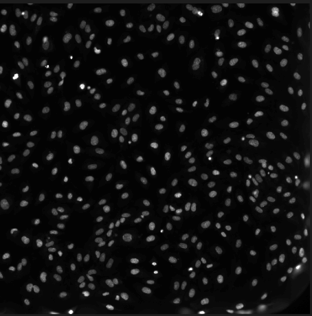
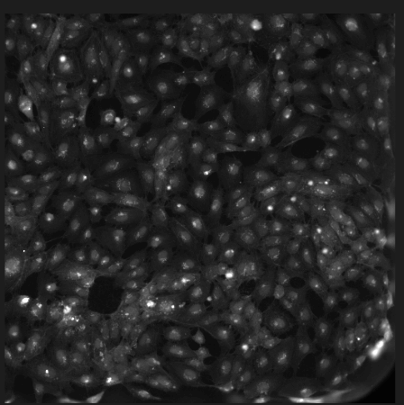
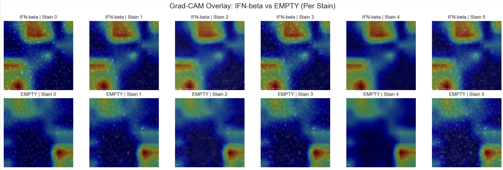
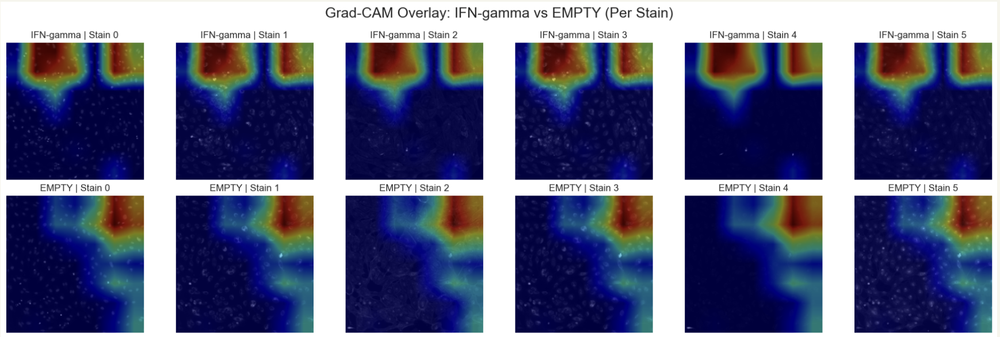
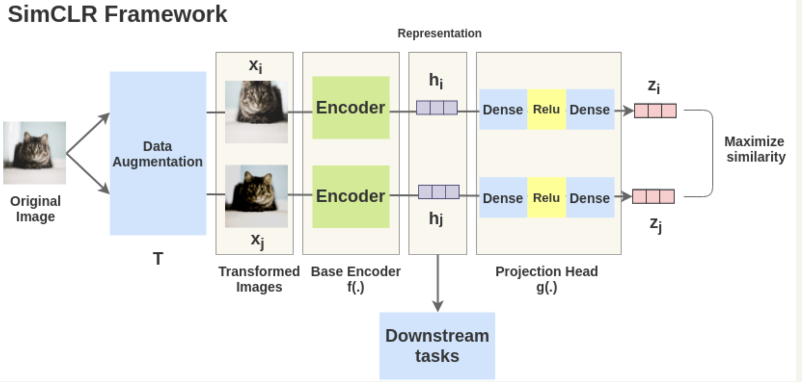
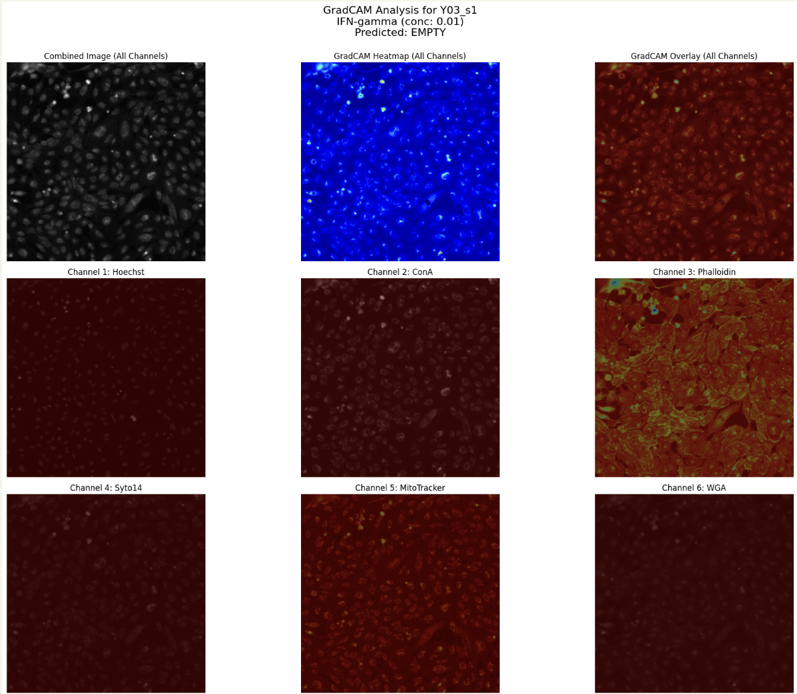

# Drug Response CNN Classification: DATASCI 207 Applied Machine Learning Final Project

  
  

## Overview

This project uses deep learning to analyze and classify cellular responses to different drug treatments using microscopy images. We specifically focus on Interferon treatments (IFN-alpha, IFN-beta, IFN-gamma, and IFN-omega) and use a Self-Supervised Learning approach with Contrastive Learning (SimCLR) to extract meaningful features from cell images.

### Why This Matters

- **Biological Relevance**: Understanding how different drugs affect cell behavior is critical to drug discovery and disease treatment
- **Biomedical Research**: Helps researchers quickly and critically analyze microscopy images with deep learning to extract meaningful features
- **Real-World Impact**: Enables identification of new drug effects faster, and understanding what happens on a cellular level when treatment is administered

## Dataset

The project uses the [**RxRx2** dataset](https://www.rxrx.ai/rxrx2), which contains:
- 131,953 fluorescence microscopy images of cells exposed to different drug treatments
- Each sample has 6 stain channels capturing different cellular components
- 128-dimensional feature embeddings for each image
- 434 unique treatments with 288 samples each

### Fluorescence Microscopy Images

Fluorescence microscopy allows us to visualize specific cellular components by using fluorescent dyes. Below are examples of cell microscopy images from our dataset:

  
  
  

Each image captures different cellular structures and responses to drug treatments, providing rich visual data for our model to learn from.

### Focused Subset: Interferons

We narrowed our scope to focus on interferons, which are naturally occurring proteins produced by the body to help fight infection and other diseases:

| Treatment | Description | Samples Count |
|-----------|-------------|---------------|
| IFN-alpha | Immune regulatory protein that enhances cell-mediated cytotoxicity against tumor cells | 287 |
| IFN-beta | Works to reduce inflammation and protect nerve cells | 287 |
| IFN-gamma | Plays a role in regulating antibody production and immune cell development | 287 |
| IFN-omega | Inhibits proliferation of a variety of tumor cell lines in vitro | 287 |
| Control | No treatment | 287 (downsampled from 7,579) |

   
  

## Model Architecture

Our approach went through several iterations before settling on a self-supervised learning workflow:

### SimCLR (Simple Framework for Contrastive Learning of Visual Representations)

SimCLR is a simple framework for contrastive learning of visual representations without requiring specialized architectures or memory banks. Our implementation:

  

The SimCLR framework consists of:
- Data augmentation: Creating different views of the same image
- A base encoder (DenseNet121): Extracting features from augmented images
- Projection head: Mapping representations to the space where contrastive loss is applied
- Contrastive loss function: Bringing similar samples together while pushing dissimilar ones apart

### Final Workflow

1. **Build SimCLR Encoder**
   - Learn rich, stain-invariant features from unlabeled images
   - Uses DenseNet121 pre-trained on ImageNet as backbone
   - Projects 6-channel microscopy images to 3 channels via Conv2D layers

2. **Train with Contrastive Loss**
   - Uses NT-Xent (Normalized Temperature-scaled Cross Entropy) loss
   - Encourages model to cluster similar views & separate unrelated ones

3. **Freeze Encoder**
   - Preserves the learned representations

4. **Train Classifier Head**
   - Fine-tunes on labeled data for interpretable predictions

5. **Extract Embeddings**
   - Prepares inputs for other classifiers/visualizations

6. **Train Random Forest**
   - Compares classification performance using the extracted features

7. **Run Grad-CAM**
   - Understands model focus areas across the 6 stain channels

### Image Augmentation

Since SimCLR works by comparing images, we applied the following augmentations:
- Image brightening
- Random flipping
- Random cropping + resizing
- Random brightness adjustments
- Gaussian noise (to simulate camera/staining variation)

## Results

### SimCLR Training Loss

| Treatment | Loss |
|-----------|------|
| IFN-alpha | 2.84 |
| IFN-beta | 2.86 |
| IFN-gamma | 2.83 |
| IFN-omega | 2.84 |

### Classification Performance

| Treatment | Validation Accuracy | Test Accuracy | Precision | Recall | F1 |
|-----------|---------------------|--------------|-----------|--------|-----|
| IFN-alpha | 54.78% | 53.91% | 54.45% | 54.39% | 53.91% |
| IFN-beta | 62.61% | 69.57% | 67.80% | 70.18% | 68.97% |
| IFN-gamma | 51.30% | 52.17% | 61.29% | 66.67% | 63.87% |
| IFN-omega | 67.83% | 56.52% | 50.82% | 54.39% | 52.54% |

## Model Interpretation with Grad-CAM

Gradient-weighted Class Activation Mapping (Grad-CAM) is a powerful visualization technique that helps us understand what regions of an input image are most important for a model's classification decision. 

### How Grad-CAM Works

1. The technique uses the gradients flowing into the final convolutional layer to highlight the regions in the input image that are most influential for the prediction.
2. The resulting heatmap shows which parts of the image the model is focusing on when making predictions.
3. Warmer colors (red, yellow) indicate areas of high importance, while cooler colors (blue) represent areas of lower importance.

### Grad-CAM Visualization for Interferon-Gamma

Below is a Grad-CAM visualization showing what our model focuses on when classifying cell images treated with Interferon-Gamma:

  

#### Key Observations:

- The model focuses on specific cellular structures and morphological changes induced by IFN-gamma.
- These highlighted regions correspond to areas where the drug treatment causes notable changes in cell appearance or behavior.
- By comparing Grad-CAM visualizations across different treatments, we can identify distinctive patterns that characterize each drug response.

This interpretability technique helps bridge the gap between deep learning and biomedical research by providing visual evidence of what cellular features are most relevant for classification, potentially leading to new biological insights.

## Conclusion & Applications

Our approach using SimCLR demonstrates how self-supervised learning can be applied to biomedical imaging for drug response classification:

- **Drug Discovery Acceleration**: Spot cellular changes from new compounds before we know what they do
- **Hidden Phenotype Detection**: Reveal subtle treatment effects that humans and traditional supervised models might miss
- **Smarter Drug Repurposing**: Find unexpected similarities between treatments by clustering learned cell embeddings

## Contributors

- Katya Aukamp
- Luc Rieffel
- Ameya Chander

## References

- Sypetkowski et al. 2023
- Cuccarese, M. F., et al. 2020. Functional immune mapping with deep-learning enabled phenomics applied to immunomodulatory and COVID19 drug discovery. bioRxiv. https://doi.org/10.1101/2020.08.02.233064
- Minhaz, M. (2020, July 28). SimCLR explained in simple terms. Medium. https://medium.com/one-minute-machine-learning/simclr-explained-in-simple-terms-3fa69af45ff9
- Scaler. (n.d.). Self-supervised learning in Keras. Scaler Topics. https://www.scaler.com/topics/keras/self-supervised-learning-keras/
- Sharma, A. (2021, June 23). NT-Xent (Normalized Temperature-scaled Cross Entropy) loss — explained and implemented in PyTorch. Towards Data Science. https://towardsdatascience.com/nt-xent-normalized-temperature-scaled-cross-entropy-loss-explained-and-implemented-in-pytorch-cc081f69848/

## License

This project is licensed under the MIT License - see the [LICENSE](LICENSE) file for details.